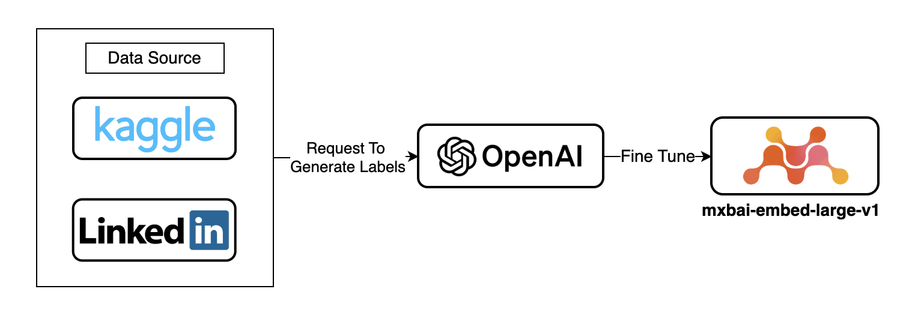
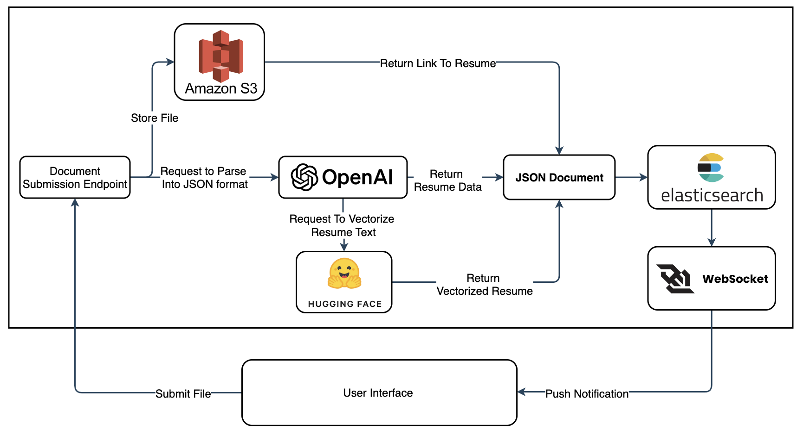
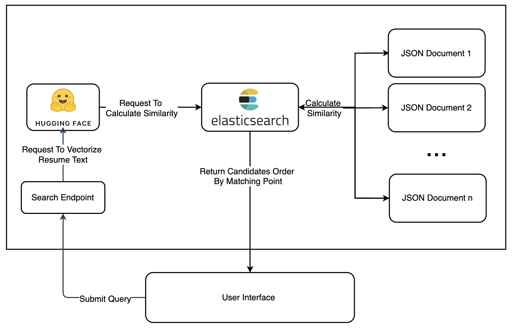
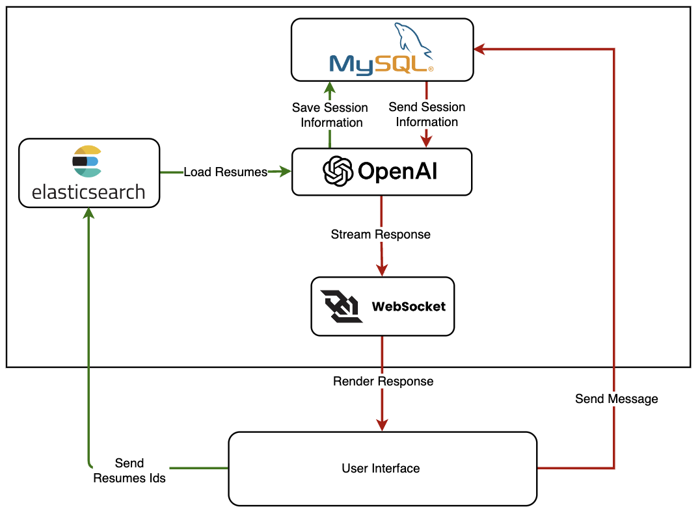

# CVSeeker Backend Services

## Table of Contents
- [1. Introduction](#1-introduction)
- [2. Demo](#2-demo)
- [3. Model Fine-Tuning](#3-model-fine-tuning)
- [4. Data Processing Service](#4-data-processing-service)
- [5. Search Service](#5-search-service)
- [6. Chatbot Service](#6-chatbot-service)
- [7. Environment Variables](#7-environment-variables)
- [8. Deployment Instructions](#8-deployment-instructions)

## 1. Introduction
CVSeeker is a backend service designed to streamline the hiring process by leveraging advanced technology for resume analysis and candidate search.

- **Database Population**: Crawl potential LinkedIn profile using profile URL as input and populate into database.
- **Automated Data Processing**: Automatically processes resumes, converting them into json structured data and embedding them for efficient searching.
- **Powerful Search**: Combines keyword and semantic search powered by Elasticsearch to help recruiters find the most relevant candidates quickly.
- **AI-Powered Chatbot**: Enables recruiters to interact with resumes via a chatbot that understands and responds to queries using OpenAI’s Assistant API.

- [Slides](statics/PresentationSlides.pdf)

## 2. Demo
- [Demo Video](https://drive.google.com/file/d/1vHJdc0wk0tcITZD2GSV23cpZ-r-BLrtB/view?fbclid=IwZXh0bgNhZW0CMTAAAR02DHzEFnhpDIgEV0v18G-b4bcSxGyKEhD8fyCfWyR5debmsU-t1V5uYxc_aem_AbJ6PRDlhm0-QmW1tgnVHTFOkRynqyv0QpoCc8_QQOoWNvWiTLF-ijalpVoijP4aYvV-nWLum2Cxt_N2k0oM0pLU)

## 3. Model Fine-Tuning
We finetune a vector embedding model to facilitate the semantic search task.

1. **Data Collection:** We gather extensive [datasets](https://github.com/tunghng/CVSeeker/tree/main/model/data) from platforms such as Kaggle and LinkedIn (~5000 instances), which provide a diverse range of professional profiles and job descriptions.
2. **Automated Labeling:** Using OpenAI's GPT models, we automatically generate labels for the collected data. 
3. **Model Fine-tuning:** The labeled data is then used to fine-tune the [mxbai-embed-large-v1](https://huggingface.co/mixedbread-ai/mxbai-embed-large-v1) model. 

   ****

## 4. Data Processing Service
When a resume is uploaded, the data processing service initiates a background job to handle the file:
1. **File Storage:** The resume is stored in AWS S3.
2. **Data Parsing:** The full text of the resume is extracted and formatted using OpenAI's GPT into a predefined JSON structure.
3. **Vector Embedding:** The text is also sent to a Hugging Face model to be converted into vector format.
4. **Indexing:** The JSON data, vector array, and S3 link are indexed in Elasticsearch.
5. **Notification:** A WebSocket sends real-time notifications to the client about the status of the upload.

### Data Structure Example
```json
{
    "summary": "Provide a concise professional summary based on the resume.",
    "skills": ["List of skills"],
    "basic_info": {
        "full_name": "Invented Full Name",
        "university": "Generated University Name",
        "education_level": "BS",
        "majors": ["List of Majors", "GPA: 3.5"]
    },
    "work_experience": [{
        "job_title": "Title",
        "company": "Company Name",
        "location": "Location",
        "duration": "Duration",
        "job_summary": "Job responsibilities and achievements"
    }],
    "project_experience": [{
        "project_name": "Project Name",
        "project_description": "Project details including technologies used"
    }],
    "award": [{"award_name": "Award Name"}]
}
```

****

## 5. Search Service
The search service allows users to perform hybrid searches combining keyword and semantic approaches:
1. **Query Input:** Users input a search query with a semantic threshold.
2. **Vectorization:** The query is vectorized using the same Hugging Face model.
3. **Matching:**
   - Step 1: Use ANN to narrow down potential matches.
   - Step 2: Compute cosine similarity with all resumes in the Elasticsearch index.

Results are presented in the search interface, ranked by match quality.

****

## 6. Chatbot Service
Users can interact directly with selected resumes through a chat interface powered by OpenAI's Assistant API:
1. **Session Management:** Users start chat sessions with selected resumes. Each session creates a new thread, and all candidate information is loaded into this thread.
2. **Interaction:** User messages are processed by the Assistant API, with responses streamed back to the frontend via WebSocket.
3. **Session Continuity:** Users can revisit previous threads to continue interactions and review associated resumes.

****

## 7. Environment Variables
Before starting the application, configure the `.env` file with the necessary environment variables. Below is a guide on where to find or how to set these variables:

```plaintext
# Basic Configuration
ENVIRONMENT="LOCAL" # Set to "LOCAL" for development or "PRODUCTION" for deployment
CONTEXT_PATH="/cvseeker" # The base path for the application
HTTP_PORT="8080" # The port on which the application will run
APP_NAME="CVSeeker" # The name of the application

# Elasticsearch Configuration (obtain these from your Elastic Cloud account)
ELK_URL="" # The URL to your Elasticsearch instance
ELK_USERNAME="" # Username for Elasticsearch access
ELK_PASSWORD="" # Password for Elasticsearch access
ELK_DOCUMENT_INDEX="" # The name of the index where documents are stored
ELK_CLOUD_ID="" # The cloud ID from your Elastic Cloud deployment

# Database Configuration (MySQL settings)
DB_MYSQL_LOG_BUG="true" # Enable logging for database interactions, useful for debugging
DB_MYSQL_USERNAME="mysql" # Username for MySQL database access
DB_MYSQL_PASSWORD="mysql" # Password for MySQL database access
DB_MYSQL_HOST="host.docker.internal" # Host address for the MySQL database
DB_MYSQL_PORT=3307 # Port number for the MySQL database
DB_MYSQL_DATABASE="TalentAcquisition" # Database name

# OpenAI Configuration (obtain these by creating an agent in OpenAI's platform)
GPT_API_KEY="" # API key for accessing OpenAI services
CHAT_GPT_MODEL="gpt-3.5-turbo" # The model ID for the GPT model being used
DEFAULT_OPENAI_ASSISTANT="" # ID of the OpenAI Assistant created in the OpenAI platform

# Hugging Face Configuration (obtain from your Hugging Face account)
HUGGINGFACE_API_KEY="" # API key for accessing Hugging Face models
HUGGINGFACE_MODEL="nhinbm/recruit_finetune" # The specific Hugging Face model used for vector embedding

# AWS Configuration (obtain these from your AWS Management Console)
AWS_ACCESS_KEY="" # Your AWS Access Key
AWS_SECRET_KEY="" # Your AWS Secret Key
AWS_REGION="" # The AWS region where your services are deployed
AWS_BUCKET="" # The name of the AWS S3 bucket used for storing resumes
```

## 8. Deployment Instructions

To deploy the CVSeeker application using Docker Compose, follow these steps:

1. **Ensure Docker and Docker Compose are installed on your system.**

2. **Clone the repository:**
    ```sh
    git clone https://github.com/tunghng/CVSeeker.git
    cd CVSeeker
    ```

3. **Build and start the containers:**
    ```sh
    docker-compose up --build
    ```

4. **Access the application:

**
Open your browser and navigate to `http://localhost:5173` to use the CVSeeker application.

5. **Stop the containers:**
    ```sh
    docker-compose down
    ```

