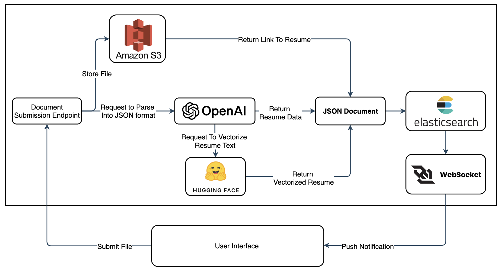
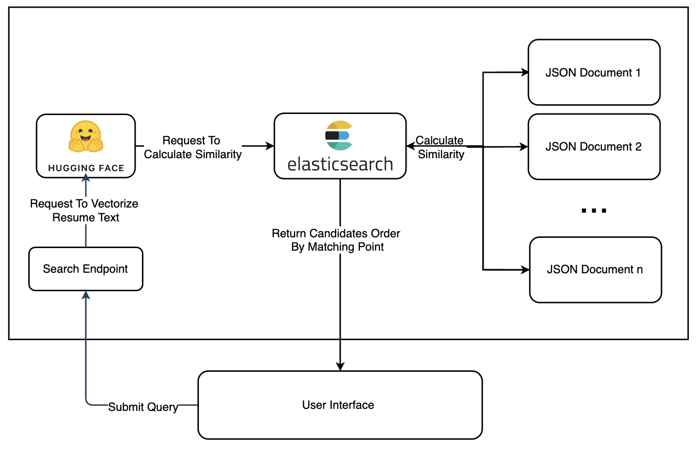
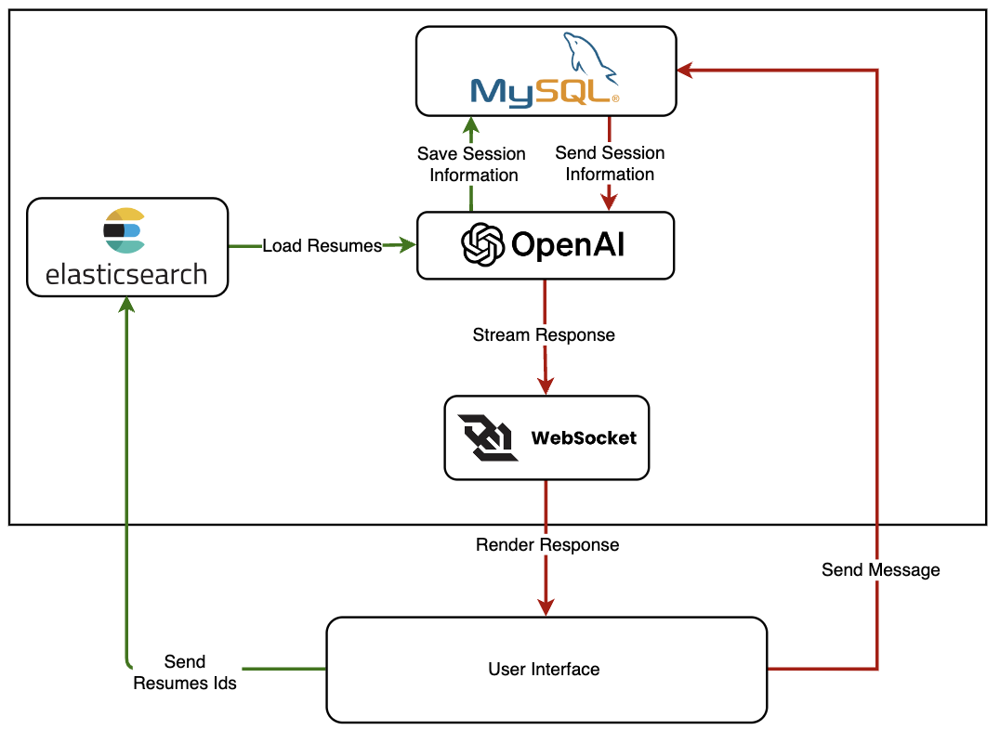

# CVSeeker Backend Services

## Table of Contents
- [1. Introduction](#1-introduction)
- [2. Data Processing Service](#2-data-processing-service)
- [3. Search Service](#3-search-service)
- [4. Chatbot Service](#4-chatbot-service)

## 1. Introduction
CVSeeker is designed to streamline the talent acquisition process, enabling teams to efficiently find and engage candidates within their talent pool. This documentation outlines the backend services that support this application.

**[Insert System Architecture Diagram Placeholder]**

## 2. Data Processing Service
### Workflow
When a resume is uploaded, the data processing service initiates a background job to handle the file:
1. **File Storage:** The resume is stored in AWS S3.
2. **Data Parsing:** The full text of the resume is extracted and formatted using OpenAI's GPT into a predefined JSON structure.
3. **Vector Embedding:** The text is also sent to a Hugging Face model to be converted into vector format.
4. **Indexing:** The JSON data, vector array, and S3 link are indexed in Elasticsearch.
5. **Notification:** A WebSocket sends real-time notifications to the client about the status of the upload.

### Data Structure Example
```json
{
    "summary": "Provide a concise professional summary based on the resume.",
    "skills": ["List of skills"],
    "basic_info": {
        "full_name": "Invented Full Name",
        "university": "Generated University Name",
        "education_level": "BS",
        "majors": ["List of Majors", "GPA: 3.5"]
    },
    "work_experience": [{
        "job_title": "Title",
        "company": "Company Name",
        "location": "Location",
        "duration": "Duration",
        "job_summary": "Job responsibilities and achievements"
    }],
    "project_experience": [{
        "project_name": "Project Name",
        "project_description": "Project details including technologies used"
    }],
    "award": [{"award_name": "Award Name"}]
}
```

****

## 3. Search Service
The search service allows users to perform hybrid searches combining keyword and semantic approaches:
1. **Query Input:** Users input a search query with a semantic threshold.
2. **Vectorization:** The query is vectorized using the same Hugging Face model.
3. **Matching:**
    - Step 1: Use ANN to narrow down potential matches.
    - Step 2: Compute cosine similarity with all resumes in the Elasticsearch index.

Results are presented in the search interface, ranked by match quality.

******

## 4. Chatbot Service
Users can interact directly with selected resumes through a chat interface powered by OpenAI's Assistant API:
1. **Session Management:** Users start chat sessions with selected resumes. Each session creates a new thread, and all candidate information is loaded into this thread.
2. **Interaction:** User messages are processed by the Assistant API, with responses streamed back to the frontend via WebSocket.
3. **Session Continuity:** Users can revisit previous threads to continue interactions and review associated resumes.

******

